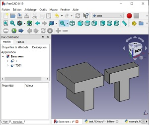

## FreePySCAD
You like [OpenSCAD](https://openscad.org/) but you hate it at the same time?  
You can't work in [FreeCAD](https://freecadweb.org) because don't like wasting your time moving the mouse and clicking?

__FreePySCAD__ is for you!

FreePySCAD is a python library for FreeCAD that lets users write their code in a text editor and see the result after a "compilation" process, like OpenSCAD but in FreeCAD.

_Note:_ it's in a beta stage right now. You can use it but some functions may have some restrictions (these should be indicated here or in the wiki).

## Requirements

[FreeCAD v0.19](https://github.com/FreeCAD/FreeCAD/releases/tag/0.19_pre) due to the `text()` function, but it may be able to run in older FreeCAD versions if you don't use it.

## Installation

As mentioned above, FreePySCAD is a python library. To install the library:

1. Locate your default FreeCAD user directory is:
   * On Linux it is usually `/home/username/.FreeCAD/Mod/`
   * On Windows it is `%APPDATA%\FreeCAD\Mod\`, which is usually `C:\Users\username\Appdata\Roaming\FreeCAD\Mod\`
   * On macOS it is usually `/Users/username/Library/Preferences/FreeCAD/Mod/`. 
   **Tip:** one way to get to the preferences directory is to use the "Finder" menu item `Go → Go to Folder`, and entering `~/Library/Preferences/FreeCAD`.  

2. Open a terminal window and invoke:
   `git clone https://github.com/supermerill/FreePySCAD`
3. Start FreeCAD
4. To begin coding open the FreeCAD macro editor and append the following to the top of the file:
`from FreePySCAD.freepyscad import *`
**Note:** You can also type in the python console: 
`exec(open('path_to/my_pycad.py').read())` 
This has the advantage to output errors.

The geometry passed inside the `scene().redraw(...)` function will be added inside the current document, replacing everything.

## How does it differ from OpenSCAD?
* Braces are replaced with parenthesis  
* The `;` (semicolons) are replaced with `,` (commas) and is required to place it after `)` if no other `)` are directly after that to respect the python syntax.  
* Modifiers like `translate`, `rotate` must not be unattached. Use the parenthesis or a dot: 
  ```
    OpenSCAD:   difference(){ translate([1,1,0]) cube(2); rotate([0,0,45]) cube(2); }
    FreePySCAD: difference()( translate([1,1,0]).cube(2), rotate([0,0,45])(cube(2)),)
  ```

* It's possible to write more concise code with FreePySCAD if one prefers (I got tired of writing `translate([ ])` over and over again)
  ```
    cut()( move(1,1).cube(2), cube(2).rotate(0,0,60) , rotate(z=30)(cube(2)) )
  ```
* Functions with real variables that can be changed! Here is a working ugly example:

  ```
	from FreePySCAD.freepyscad import *
	def make_T(l,h):
		big = cube(l,w,h)
		l = l/3.0
		h = 2.0*h/3.0
		return cut("T")(
			big,
			cube(l,w,h),
			cube(l,w,h).move(l*2),
		)
    w=10
	T_10cube = make_T(10,10)
	w=3
	T_3cube = make_T(10,10)
	scene().redraw(
		T_10cube,
		T_3cube.move(12),
	)
  ```
  

  **Note:** that you have to pass your objects inside the `scene.redraw()` function to put them into the FreeCAD environment.
  Here is a possible translation of the openscad README example :
  ```
	from FreePySCAD.freepyscad import *
	scene().redraw(
		union()(
			cylinder(h=30, r=8),
			translate([0, 0, 40]).sphere(20),
		)
	)
  ```
  But I prefer to write it this way:
  ```
	from FreePySCAD.freepyscad import *
	scene().redraw(
		union()(
			cylinder(r=8, h=30),
			sphere(20).move(z=40),
		)
	)
  ```
* Unimplemented: `resize`, `minkowski` and `hull` 
* `offset(2,True)(thing())` is similar to `minkowski(){thing(); sphere(2);}`

You can see and execute some complex examples in the examples directory
## FreePySCAD cheatsheet:

#### 1D
* `line([x1,y1,z1],[x2,y2,z2])`
* `arc([x1,y1,z1],[x2,y2,z2],[x3,y3,z3])`
* `helix(r,p,h)` 
p = pitch = height between the beginning and the ending of a single loop

#### 1D | 2D
* `circle(r)`
* `ellipse(r,l)`
* `polygon([points],closed)`
* `bspline([points],closed)`
* `bezier([points],closed)`

#### 2D
* `square(size)`
* `square([width,height])` | `square(width,height)` | `rectangle([width,height])`
* `poly_reg(r|d,nb,inscr)`
* `text(text,size)`
* `gear(nb, mod, angle, external, high_precision)`


#### Transformation 1D to 2D to 3D:
* `create_wire(closed)(...1D)`
  create a new wire from many edges, can be extruded if they are connected, you can check that by setting `closed` to True
* `offset2D(length,fillet,fusion)(...2D)`
* `linear_extrude(height,twist,taper)(obj_2D)`
* `extrude(x,y,z,taper)(obj_2D)`
* `rotate_extrude(angle)(obj_2D)` rotate over the Z axis
* `path_extrude(frenet,transition)(path_1D, patron_2D)`

**Note:** most of these transformations can only work on a single object, as these can't be unionized before.

#### 3D
* `sphere(r|d,fn)`
* `cube(size)`
* `cube(x,y,z)` | `cube([width,depth,height])` | `box(x,y,z)`
* `triangle(x,y,z)` | `triangle([width,depth,height])`
* `cylinder(r|d,h,fn,angle) # will call poly_ext if fn >0`
* `cone(r1|d1,r2|d2,h,fn) | cylinder(r1|d1,r2|d2,h,fn)`
* `torus(r1,r2,h)`
* `poly_ext(r,nb,h)`
Note: `r` = radius, `nb` = nb vertex (min 3)
* `poly_int(a,nb,h)`
Note: `a` = apothem, `nb` = nb vertex (min 3)`
* `ngon(r|d|a,n,h) # same as poly_ext/poly_int`
* `polyhedron(points, faces)`
for debugging use `polyhedron_wip`, it creates a group of points & faces instead of a 3D solid mesh
* `solid_slices(points, centers)`
new way to create not-so complicated shells, see below. centers are optional. Much simpler than polyhedron. May not work with not-convex shapes
* `thread(r,p,nb,r2, pattern,fn,center)` 
implementation of a way to create threads with pattern (2D array of points). It creates a new 3D object from triangles (vertices & faces).
* `iso_thread(d,p,h,internal,offset,fn)` 
usage of thread method with an iso pattern.

#### 3D Boolean operations
* `union()(...3D)` | `union().add(...3D)` 
may also work with 2D
* `intersection()(...3D)`
* `difference()(...3D)` | `cut()(...3D)`

#### Transformations
* `mirror(x,y,z)(...)` | `mirror([x,y,z])(...)`
* `offset(length,fillet,fusion)(...3D)`

Chamfer and fillet can fail if the length is too big for an edge, so prefer using it on simple object or it can fail and makes your object disappear. Also, in this simple version they only work with one object and one length for all edges.
* `chamfer(l)(3D)`
* `fillet(l)(3D)`

WIP, don't work (ids can change widly, need to use absolute positioning)
use the gui, the offset or the dangerous (if done on complex part) `.chamfer|.fillet`
* `chamfer().setEdges(radius,edge_id...)(...3D)`
* `fillet().setEdges(radius,edge_id...)(...3D)`

#### Modifiers:
* `.x/y/z()` | `.center()`
* `translate/move(x,y,z)(...)` | `move([x,y,z])(...)` | `.move(x,y,z)` | `.move([x,y,z])` | `move(x,y,z).stdfuncXXX(`
* `rotate(x,y,z)(...)` | `rotate([x,y,z])(...)` | `.rotate(x,y,z)` | `.rotate([x,y,z])` | `rotate(x,y,z).stdfuncXXX(`
* `.color("colorname")` | `.color(r,g,b,a)` | `.color([r,g,b,a])` | `color(something)(...)` | `color(something).stdfuncXXX(`
**Note**: may not work as intended in certain circumstances.
* `.multmatrix(m)`
* `scale(x,y,z)(...)` | `scale([x,y,z])(...)` | `.scale(x,y,z)` | `.scale([x,y,z])` | `scale(x,y,z).stdfuncXXX(`
**!!** Don't use `scale()` if you can avoid: this function doesn't exist in FreeCAD, so this method tries to return back into the object tree to change values, but this can easily fail. Prefer to create the object at the right size from the get-go, using parametric variables if needed.

#### Other:
* `scene().draw(...3D) | scene().redraw(...3D) # redraw() erase everything in the document before rebuilding the object tree. Draw() try to update when possible and don't erase everything, but sometimes it fail to detect a change.`
* `importSvg(filepath,ids) # ids is an optional array of index to say which one have to be imported`
* `importStl(filepath,ids)`
* `group()(...) # a group of nodes (1D, 2D & 3D can be mixed), for viewing purpose only as it can't be used by anything, although you can use the modifiers.`

All python syntax and standard library can be used  

### Notes 
* ...3D represent a list (possibly empty) of 3D node
* You can replace `)(...)` with `).add(...)` for union, difference and
* **Center**: on almost every object, you can set as parameter, `center=True` or `center=center_x, center=center_yz, ...`
  *  you can also use the transformation `.center()` or `.x(), .yz(), .xyz() ....`
* **Label**: on almost everything, you can set the "name" parameter to whatever you want, it will be shown in the FreeCAD object hierarchy. If you export an AMF file, the root object name will be used for the file content.
* The notation `move(2).box(1)` should be used only when it's very convenient. It's here mainly to make conversion from OpenSCAD to FreePySCAD easier, but it can lead to strange behavior, see the two points below.
* Order of execution: `move(6)(move(3).move(2).cube(1).move(4).move(5))` => it begins at the object then moves away from it.
* The `move(2).box(1)` works but you cannot do `move(1).myfunc()` because `myfunc` isn't in the list of functions that is available to the "move object". In this case, you have to use `move(1)(myfunc())` or `myfunc().move(1)`
* When a part fails to compile, it creates a sphere of size `_default_size`. you can change the variable `_default_size`, it's used as a default value when `0.0` will create an impossible object.  
Example: `circle() == circle(_default_size)`
* **solid_slices** need a double-array of points. Each array of points is a slice. It creates triangles to join one slice to the next. The last point of each slice have to be approximately aligned ( = don't put them 180° apart), because it's used as the first edge. The middle point (mean of all points if not given via the centers argument) is used to choose the next point to draw triangle and for closing the shell at the bottom layer and top layer. The line from the center of a slice to the center of the next one must be inside the slice and the next slice.

## LICENCE

[GPLv3](LICENCE)